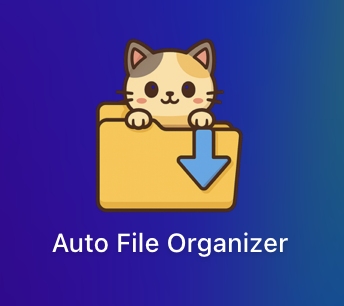
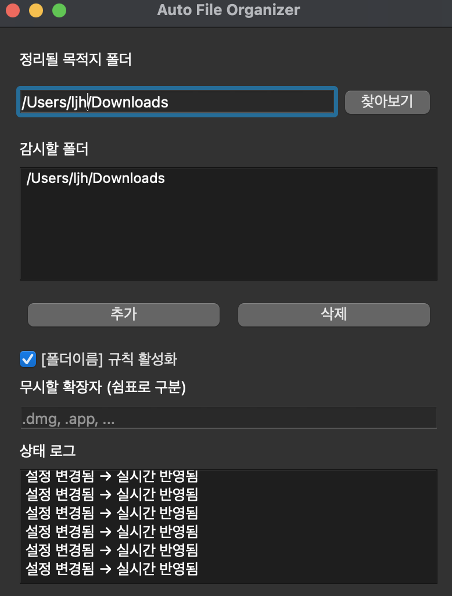

# Auto File Organizer

 
원하는 폴더에 새로운 파일이 생성되었을때, 파일을 정리해주는 Mac OS 응용 프로그램

<video src="resources/test.mp4" controls autoplay loop style="max-width: 100%; height: auto;">
  Your browser does not support the video tag.
</video>

## 다운로드
https://drive.google.com/file/d/1mPjj-GBv8KpsHNSDhBf9MzKP80lBNsXH/view?usp=sharing

## 기능

## 사용 기술스택
Python3.13, PyQt5, watchDog